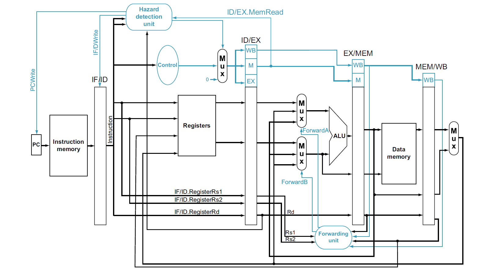
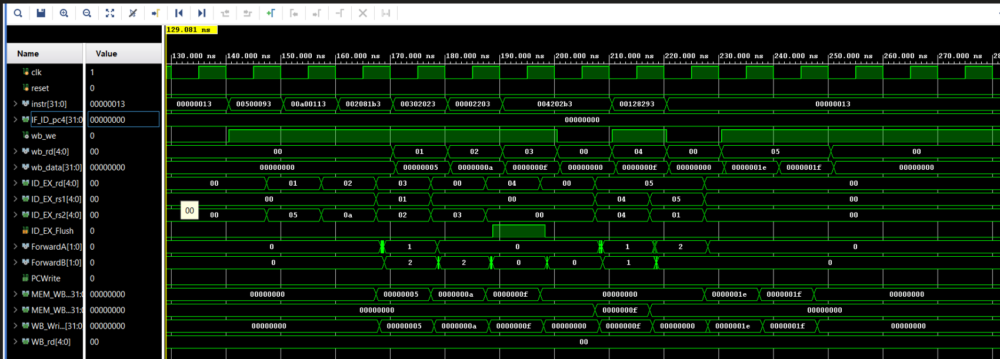
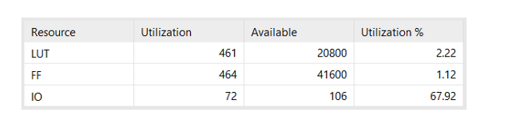
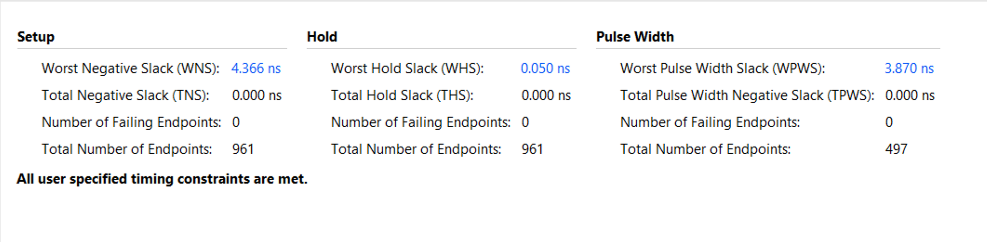
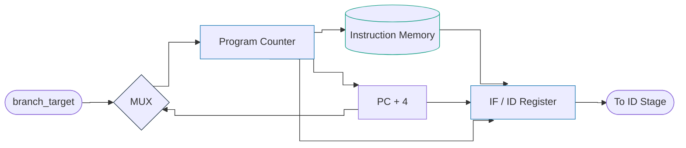
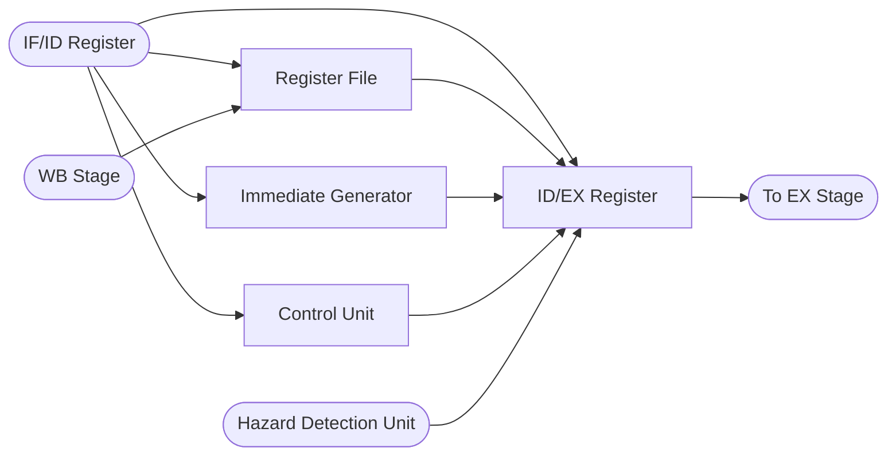
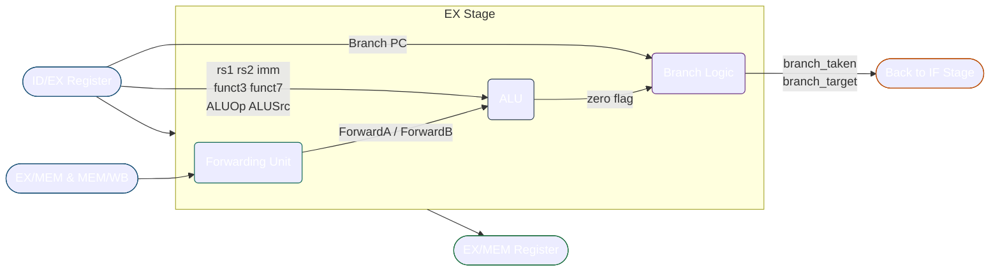
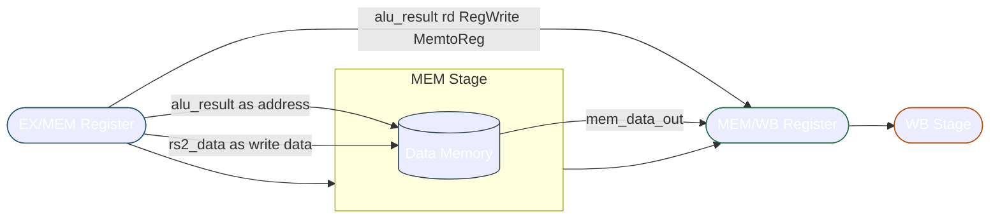
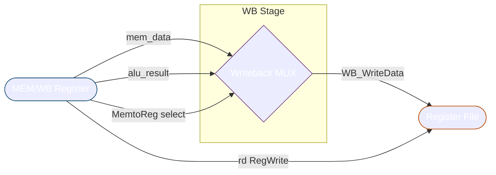

<!-- # 32-bit Pipelined RISC-V Processor (RV32I)

This repository contains the RTL design, verification, and synthesis results of a **32-bit 5-stage pipelined RISC-V processor** implementing a subset of the **RV32I ISA**.
The processor is designed in **Verilog**, verified using **behavioral and post-synthesis simulation**, and synthesized using **Xilinx Vivado**.

---

## 🔹 Key Features

- 32-bit RISC-V (RV32I subset)
- Classic **5-stage pipeline**
  - Instruction Fetch (IF)
  - Instruction Decode (ID)
  - Execute (EX)
  - Memory Access (MEM)
  - Write Back (WB)
- **Data forwarding**
  - EX–EX forwarding
  - MEM–EX forwarding
- **Load-use hazard detection**
  - Single-cycle pipeline stall
  - PC and IF/ID freeze with ID/EX bubble insertion
- Separate Instruction and Data Memories
- Synthesizable on FPGA
- Verified using **behavioral and post-synthesis simulation**

---

## 🔹 Pipeline Architecture

The processor follows the standard 5-stage RISC-V pipeline with forwarding and hazard detection.

<p align="center">
  
</p>

### Pipeline Registers

- IF/ID
- ID/EX
- EX/MEM
- MEM/WB

---

## 🔹 Hazard Handling

### Data Forwarding

To resolve data hazards without stalling:

- Forwarding from **EX/MEM → EX**
- Forwarding from **MEM/WB → EX**

The forwarding unit compares source registers (`rs1`, `rs2`) with destination registers (`rd`) in later stages and selects the correct operand through multiplexers.

### Load-Use Hazard

When an instruction immediately depends on a previous `lw`:

- PC write is disabled
- IF/ID register is frozen
- A bubble (NOP) is inserted into ID/EX

This introduces a **single-cycle stall**, ensuring correctness.

---

## 🔹 Verification Strategy

### Behavioral (RTL) Simulation

A simple, readable RTL testbench is used to validate:

- Individual instruction correctness
- EX-EX and MEM-EX forwarding
- Load-use hazard stall behavior

Verification is done by observing **architectural write-back values**.

Example instruction sequence:

```assembly
addi x1, x0, 5
addi x2, x0, 10
add  x3, x1, x2      # forwarding
sw   x3, 0(x0)
lw   x4, 0(x0)
add  x5, x4, x4      # load-use stall
addi x5, x5, 1
```

## Expected Final Register Values

| Register | Value |
| -------- | ----- |
| x1       | 5     |
| x2       | 10    |
| x3       | 15    |
| x4       | 15    |
| x5       | 31    |

---

## Post-Synthesis Simulation

- The same testbench used for RTL (behavioral) simulation is reused
- Behavioral and post-synthesis simulation results match at the architectural level

<p align="center">
  
</p>

This confirms that **synthesis preserves functional correctness**.

---

## Synthesis Results (Artix-7)

**Target Device:** `xc7a35t`

### Resource Utilization

<p align="center">
  
</p>

---

### Timing Summary

<p align="center">
  
</p>

All user-specified timing constraints are met.

---

## Critical Path Analysis

The critical path lies within the **EX stage**, from the EX/MEM register through:

- Forwarding compare logic
- Operand multiplexers
- ALU computation
- Back into the EX/MEM register

Even with a **carry-save based ALU**, the forwarding control and high fan-out multiplexing dominate the delay, which is expected in a pipelined CPU design.

---

## Tools Used

- **Language:** Verilog
- **Simulation:** XSim (Vivado)
- **Synthesis & Timing:** Xilinx Vivado
- **Target FPGA:** Artix-7

---

## Future Work

- Branch and jump instructions
- Pipeline flush support
- True BRAM-based instruction and data memory
- FPGA board bring-up

--- -->

# 🖥️ Pipelined RISC-V RV32I Core

<p align="center">
  
</p>

<p align="center">
  
  
  
  
  
  
</p>

---

## 📋 Table of Contents

- [Overview](#-overview)
- [Architecture](#-architecture)
- [Pipeline Stages](#-pipeline-stages)
- [Hazard Detection Unit](#-hazard-detection-unit)
- [Forwarding Unit](#-forwarding-unit)
- [Supported Instructions](#-supported-instructions)
- [Bubble Sort Case Study](#-bubble-sort-case-study)
- [Testbench](#-testbench)
- [FPGA Implementation Results](#-fpga-implementation-results)

---

## 🔍 Overview

A fully functional **5-stage pipelined RISC-V RV32I processor** implemented in Verilog and synthesized on a Xilinx Artix-7 FPGA. The core implements the classic **IF → ID → EX → MEM → WB** pipeline with:

- **Full data forwarding** — EX/MEM and MEM/WB forwarding paths eliminate most data hazards with zero stall cycles
- **Load-use hazard detection** — automatic 1-cycle stall insertion for load-use RAW hazards
- **Register file write-forwarding** — same-cycle bypass closes the WB→ID hazard class entirely
- **In-EX branch resolution** — branches evaluated in the Execute stage with a 2-instruction flush on taken branches
- **Complete RV32I subset** — ADDI, ADD, SUB, SLT, LW, SW, BEQ, BNE with proper sign extension for all immediate types

The design was validated end-to-end using an in-place **bubble sort** benchmark (`[5,3,8,1,9,2] → [1,2,3,5,8,9]`) exercising every hazard class simultaneously — and optimized from an initial 47-instruction NOP-heavy program down to a **25-instruction zero-NOP inner loop**.

---

## 🏗️ Architecture

<p align="center">
  
  <br/>
  <em>5-stage pipeline with forwarding (blue) and hazard detection (blue) control paths</em>
</p>

The architecture follows the classic Patterson & Hennessy 5-stage RISC pipeline. Forwarding paths (shown in blue) bypass data from the EX/MEM and MEM/WB pipeline registers back to the ALU input muxes in the EX stage. The Hazard Detection Unit monitors load-use and branch-taken conditions, generating `PCWrite`, `IF_ID_Write`, `ID_EX_Flush`, and `IF_ID_Flush` control signals.

---

## 🔧 Pipeline Stages

### Stage 1 — Instruction Fetch (`IF_Stage`)

<!-- ```
PC → Instruction Memory → IF/ID Register
                ↑
         branch_target (from EX)
``` -->



The PC register (`PC_hazard`) is gated by `PCWrite` from the Hazard Detection Unit. A 2:1 mux selects between `PC+4` (normal) and `branch_target` (on `branch_taken` from EX stage). The `IF/ID` pipeline register additionally carries the raw PC value forward for branch target computation, and can be independently flushed (`IF_ID_Flush`) on a taken branch.

**Key module:** `IF_ID_hazard` — supports three independent control inputs:

- `IF_ID_Write` — freeze register on load-use stall
- `IF_ID_Flush` — zero register on branch taken (kills wrong-path instruction)
- `reset` — asynchronous clear

---

### Stage 2 — Instruction Decode (`ID_Stage`)



The decode stage hosts the **32×32 register file** (2 async read ports, 1 sync write port), the **Immediate Generator** (handles I, S, B, J type sign extension), and the **Control Unit** (generates 8-bit control word from 7-bit opcode).

The `ID/EX` register (`ID_EX_hazard`) carries: rs1_data, rs2_data, rs1, rs2, rd, imm, funct3, funct7, all control signals, Branch, and PC — 14 fields total, all zeroed on flush or reset for clean bubble insertion.

---

### Stage 3 — Execute (`EX_Stage`)



The Execute stage is the most complex stage. It contains:

1. **Forwarding Unit** — 2-bit `ForwardA`/`ForwardB` select which value feeds the ALU (see [Forwarding Unit](#-forwarding-unit))
2. **ALU Control** — decodes `ALUOp[1:0]` + `funct7`/`funct3` into 4-bit ALU opcode
3. **ALU** — performs ADD, SUB, AND, OR, SLT (signed) with zero flag for branch comparison
4. **Branch Logic** — evaluates `Branch & (zero ^ funct3[0])` to produce `branch_taken`
5. **Branch target** — combinationally computed as `ID_EX_pc + ID_EX_imm`

Branch resolution in EX means only 2 instructions must be flushed on a taken branch (the instructions in IF and ID that followed the wrong path).

**ALU Operations:**

| `alu_ctrl` | Operation | Used by                         |
| :--------: | :-------: | :------------------------------ |
|   `0000`   |    AND    | R-type AND                      |
|   `0001`   |    OR     | R-type OR                       |
|   `0010`   |    ADD    | R-type ADD, LW/SW address, ADDI |
|   `0110`   |    SUB    | R-type SUB, BEQ comparison      |
|   `0111`   |    SLT    | R-type SLT (signed less-than)   |

---

### Stage 4 — Memory Access (`MEM_Stage`)



A **64-word word-addressed data memory** (`Data_Memory`). Writes are synchronous (on `posedge clk` when `MemWrite=1`). Reads are combinational (`MemRead` gated). Address decoding uses `read_address[7:2]` — i.e., byte addresses are shifted right by 2 to get word addresses, naturally supporting the RISC-V word-aligned `LW`/`SW` convention.

Both instruction and data memories are implemented as **distributed LUT RAM** (RAMS64E primitives), consuming no BRAM tiles.

---

### Stage 5 — Writeback (`WB_Stage`)



A simple 2:1 mux selects between memory read data (for `LW`) and ALU result (for R-type/ADDI). The result feeds back to the register file write port in the ID stage, and simultaneously to the forwarding unit as `MEM_WB_WriteData`.

---

## 🚨 Hazard Detection Unit

The Hazard Detection Unit (`Hazard_Detection_Unit`) is a purely combinational module that monitors two hazard conditions each cycle and generates the appropriate pipeline control signals.

### Priority 1 — Load-Use Hazard (Stall)

A load-use hazard occurs when a `LW` instruction in the EX stage writes a register that the very next instruction (currently in ID) needs to read. Since the data from memory isn't available until the end of the MEM stage, the pipeline must stall for one cycle.

**Detection condition:**

```verilog
if (ID_EX_MemRead &&
   ((ID_EX_rd == IF_ID_rs1) || (ID_EX_rd == IF_ID_rs2)) &&
   (ID_EX_rd != 0))
```

**Response — 3 simultaneous actions:**

| Signal        | Value | Effect                                            |
| :------------ | :---: | :------------------------------------------------ |
| `PCWrite`     |   0   | Freeze PC — re-fetch same instruction next cycle  |
| `IF_ID_Write` |   0   | Freeze IF/ID — hold the instruction being decoded |
| `ID_EX_Flush` |   1   | Insert bubble — zero all control signals in ID/EX |

This creates one pipeline bubble between the `LW` and its dependent instruction, giving the load result time to appear in `MEM_WB_WriteData`. The MEM/WB forwarding path (`ForwardA/B = 01`) then delivers the correct value to the ALU in the next cycle.

<!-- **Timeline:**
```
Cycle    │  IF      │  ID      │  EX      │  MEM     │  WB
─────────┼──────────┼──────────┼──────────┼──────────┼──────────
   N     │  INSTR2  │  INSTR1  │  LW x7   │          │
   N+1   │  INSTR2* │  INSTR1* │  BUBBLE  │  LW x7   │        ← stall
   N+2   │  INSTR3  │  INSTR2  │  INSTR1  │  BUBBLE  │  LW x7 ← MEM/WB fwd
* = frozen (PCWrite=0, IF_ID_Write=0)
``` -->

### Load-Use Hazard — Pipeline Timeline

| Cycle  |    IF     |    ID     |    EX    |   MEM    |     WB     |
| :----: | :-------: | :-------: | :------: | :------: | :--------: |
|   N    |  INSTR2   |  INSTR1   | `LW x7`  |    —     |     —      |
| N+1 ⚠️ | INSTR2 🔒 | INSTR1 🔒 | `BUBBLE` | `LW x7`  |     —      |
|  N+2   |  INSTR3   |  INSTR2   |  INSTR1  | `BUBBLE` | `LW x7` ✅ |

> 🔒 **Frozen** — `PCWrite = 0`, `IF_ID_Write = 0`
>
> ⚠️ **Stall inserted** — `ID_EX_Flush = 1` injects a bubble into EX
>
> ✅ **MEM/WB Forwarding fires** — `ForwardA = 2'b01` delivers load result to INSTR1 in EX

### Priority 2 — Branch Taken Flush

When `branch_taken` is asserted from the EX stage, two instructions fetched along the wrong path (one in IF/ID, one in ID/EX) must be killed.

**Detection condition:**

```verilog
if (branch_taken) begin
    IF_ID_Flush = 1'b1;   // kill wrong-path instruction in IF/ID
    ID_EX_Flush = 1'b1;   // kill wrong-path instruction in ID/EX
end
```

`PCWrite` and `IF_ID_Write` remain 1 so the correct branch target is fetched immediately. The 2-cycle branch penalty is unavoidable with EX-stage resolution but is far better than the 3-cycle penalty of MEM-stage resolution.

---

## ⚡ Forwarding Unit

The Forwarding Unit (`Forwarding_Unit`) eliminates most RAW data hazards without stalls by routing results from later pipeline stages back to the ALU inputs. It generates two 2-bit control signals each cycle.

### ForwardA / ForwardB Encoding

|  Value  | Source               | Meaning                                            |
| :-----: | :------------------- | :------------------------------------------------- |
| `2'b00` | `ID_EX_rs1/rs2_data` | No forwarding — use register file value            |
| `2'b10` | `EX_MEM_alu_result`  | EX hazard — forward from ALU output (1 cycle old)  |
| `2'b01` | `MEM_WB_WriteData`   | MEM hazard — forward from writeback (2 cycles old) |

### Priority Logic

EX forwarding takes priority over MEM forwarding — if the same register is being written by both EX/MEM and MEM/WB (rare but possible in a correctly-running program), the most recent value (EX/MEM) wins:

```verilog
// EX hazard — highest priority
if (EX_MEM_RegWrite && (EX_MEM_rd != 0) && (EX_MEM_rd == ID_EX_rs1))
    ForwardA = 2'b10;

// MEM hazard — only if EX is not also writing this register
if (MEM_WB_RegWrite && (MEM_WB_rd != 0) &&
    !(EX_MEM_RegWrite && EX_MEM_rd != 0 && EX_MEM_rd == ID_EX_rs1) &&
    (MEM_WB_rd == ID_EX_rs1))
    ForwardA = 2'b01;
```

The same logic applies symmetrically for `ForwardB` / `ID_EX_rs2`.

### What the Forwarding Unit Handles vs. What It Cannot

| Hazard                          | Example                                    | Handled by                         |
| :------------------------------ | :----------------------------------------- | :--------------------------------- |
| ALU → ALU (1 cycle apart)       | `ADD x1,x2,x3` then `ADD x4,x1,x5`         | ForwardA/B = `10`                  |
| ALU → ALU (2 cycles apart)      | `ADD x1,...` then NOP then `ADD x4,x1,...` | ForwardA/B = `01`                  |
| LW → ALU (1 cycle apart)        | `LW x7,4(x5)` then `SLT x9,x7,x6`          | HDU stall + ForwardA = `01`        |
| ALU → Branch                    | `SUB x12,x20,x3` then `BEQ x4,x12,...`     | ForwardB = `10`                    |
| WB write → ID read (same cycle) | `LW x6` in WB, `SLT` reading x6 in ID      | **Register file write-forwarding** |

### Register File Write-Forwarding — The Critical Fix

The standard EX/MEM and MEM/WB forwarding paths cover hazards that are visible in the EX stage. But there is a fourth hazard class: when WB is writing a register at the **same cycle** that ID is reading it. Because the register file uses a non-blocking write (`<=`), the combinational read ports see the old value within the same timestep.

By the time the dependent instruction reaches EX (next cycle), the `MEM_WB` register has already advanced to the next instruction, so the forwarding unit has no record of the write. The fix is a combinational bypass inside `Register_Bank`:

```verilog
// Same-cycle write-forwarding
assign read_data1 = (rs1 == 5'b0)        ? 32'b0      :
                    (RegWrite && rd==rs1) ? Write_data :
                                            Registers[rs1];

assign read_data2 = (rs2 == 5'b0)        ? 32'b0      :
                    (RegWrite && rd==rs2) ? Write_data :
                                            Registers[rs2];
```

---

## 📜 Supported Instructions

### Control Signals by Opcode

|         Instruction         |  Opcode   | ALUSrc | MemtoReg | RegWrite | MemRead | MemWrite | Branch | ALUOp |
| :-------------------------: | :-------: | :----: | :------: | :------: | :-----: | :------: | :----: | :---: |
| R-type (ADD/SUB/SLT/AND/OR) | `0110011` |   0    |    0     |    1     |    0    |    0     |   0    | `10`  |
|             LW              | `0000011` |   1    |    1     |    1     |    1    |    0     |   0    | `00`  |
|             SW              | `0100011` |   1    |    —     |    0     |    0    |    1     |   0    | `00`  |
|           BEQ/BNE           | `1100011` |   0    |    —     |    0     |    0    |    0     |   1    | `01`  |
|            ADDI             | `0010011` |   1    |    0     |    1     |    0    |    0     |   0    | `10`  |

### Immediate Type Encoding

|         Type          | Format                                            | Sign Extension                            |
| :-------------------: | :------------------------------------------------ | :---------------------------------------- |
| **I-type** (LW, ADDI) | `inst[31:20]`                                     | `{20{inst[31]}, inst[31:20]}`             |
|    **S-type** (SW)    | `inst[31:25] \| inst[11:7]`                       | `{20{inst[31]}, inst[31:25], inst[11:7]}` |
| **B-type** (BEQ, BNE) | `inst[31]\|inst[7]\|inst[30:25]\|inst[11:8]\|0`   | 13-bit signed, bit 0 always 0             |
|   **J-type** (JAL)    | `inst[31]\|inst[19:12]\|inst[20]\|inst[30:21]\|0` | 21-bit signed, bit 0 always 0             |

---

## 🔬 Bubble Sort Case Study

The bubble sort benchmark was chosen specifically because it exercises **every hazard class simultaneously** in a tight inner loop. Sorting `[5, 3, 8, 1, 9, 2]` → `[1, 2, 3, 5, 8, 9]`.

### Register Allocation

| Register | Role                                      |
| :------: | :---------------------------------------- |
|   `x1`   | Array base address (0)                    |
|   `x2`   | Array length `n = 6`                      |
|   `x3`   | Outer loop counter `i`                    |
|   `x4`   | Inner loop counter `j`                    |
|   `x5`   | Byte address of `arr[j]` = `base + j×4`   |
|   `x6`   | `arr[j]` (loaded each iteration)          |
|   `x7`   | `arr[j+1]` (loaded each iteration)        |
|   `x8`   | Temporary register for swap               |
|   `x9`   | SLT result: 1 if swap needed, 0 otherwise |
|  `x11`   | Word size constant (4)                    |
|  `x12`   | Inner loop limit = `outer_limit - i`      |
|  `x20`   | Outer loop limit = `n-1 = 5`              |

### Final Assembly Program (25 instructions + 5 drain NOPs)

```asm
; ── Initialization ──────────────────────────────────────────────────────
0x00:  ADDI x1,  x0, 0    ; base = 0 (array starts at mem[0])
0x04:  ADDI x2,  x0, 6    ; n = 6
0x08:  ADDI x11, x0, 4    ; word_size = 4
0x0C:  ADDI x20, x0, 5    ; outer_limit = n-1 = 5
0x10:  ADDI x3,  x0, 0    ; i = 0

; ── Outer Loop ──────────────────────────────────────────────────────────
OUTER:
0x14:  BEQ  x3, x20, DONE ; if i == 5, sorting complete
0x18:  ADDI x4,  x0, 0    ; j = 0
0x1C:  SUB  x12, x20, x3  ; inner_limit = 5 - i (shrinks each pass)

; ── Inner Loop ──────────────────────────────────────────────────────────
INNER:
0x20:  BEQ  x4, x12, OUTER_INC   ; if j == inner_limit, next outer pass

; Address calculation: x5 = base + j*4
0x24:  ADD  x5, x0, x0    ; x5 = 0
0x28:  ADD  x5, x4, x4    ; x5 = j + j = 2j
0x2C:  ADD  x5, x5, x5    ; x5 = 4j
0x30:  ADD  x5, x5, x1    ; x5 = base + 4j  →  &arr[j]

; Load and compare
0x34:  LW   x6, 0(x5)     ; x6 = arr[j]
0x38:  LW   x7, 4(x5)     ; x7 = arr[j+1]
0x3C:  SLT  x9, x7, x6    ; x9 = (arr[j+1] < arr[j]) ? 1 : 0

; Conditional swap
0x40:  BEQ  x9, x0, NO_SWAP  ; if x9==0, already in order
0x44:  ADD  x8, x6, x0    ; temp = arr[j]
0x48:  SW   x7, 0(x5)     ; arr[j]   = arr[j+1]
0x4C:  SW   x8, 4(x5)     ; arr[j+1] = temp

NO_SWAP:
0x50:  ADDI x4, x4, 1     ; j++
0x54:  BEQ  x0, x0, INNER ; unconditional branch back

OUTER_INC:
0x58:  ADDI x3, x3, 1     ; i++
0x5C:  BEQ  x0, x0, OUTER ; unconditional branch back

DONE:
0x60:  BEQ  x0, x0, DONE  ; halt (infinite self-loop)
0x64-0x74: NOP × 5        ; pipeline drain
```

### How Address Calculation Works Without MUL

RISC-V has no multiply instruction in the base subset used here, so `j×4` is computed using shifts-via-addition:

```
j×4 = j + j = 2j  →  2j + 2j = 4j
```

This takes 3 ADD instructions (`x5 = j+j`, `x5 = x5+x5`, `x5 = x5+base`) but is entirely correct and data-hazard free since each ADD writes a different-enough register that forwarding handles all dependencies.

### Hazards Active in the Inner Loop

Every type of hazard the pipeline can encounter fires in the inner loop:

**1. SUB → BEQ (ForwardB = `10`, EX hazard)**

```
0x1C: SUB x12, x20, x3    ← writes x12
0x20: BEQ x4,  x12, ...   ← reads x12 one cycle later
```

`EX_MEM_rd = x12` matches `ID_EX_rs2 = x12` → `ForwardB = 2'b10` → BEQ uses `EX_MEM_alu_result` (the subtraction result) directly. **Zero stall cycles.**

**2. LW x7 → SLT (HDU stall + MEM/WB forwarding)**

```
0x38: LW  x7, 4(x5)       ← writes x7 (load — result from memory)
0x3C: SLT x9, x7, x6      ← reads x7 (rs1) immediately after
```

The Hazard Detection Unit fires: `ID_EX_MemRead=1`, `ID_EX_rd=x7`, `IF_ID_rs1=x7` → **1 bubble inserted**. After the stall, `MEM_WB_rd=x7` and `ForwardA=2'b01` delivers the loaded value from `WB_WriteData`. **One stall cycle, correctly handled.**

**3. LW x6 → SLT (Register file write-forwarding)**

```
0x34: LW  x6, 0(x5)       ← writes x6 (two instructions before SLT)
0x3C: SLT x9, x7, x6      ← reads x6 (rs2)
```

By the time SLT reaches ID, `LW x6` is in WB writing `Registers[x6]`. The non-blocking write makes the combinational read return the old value. The standard forwarding unit cannot help because by the time SLT is in EX, `MEM_WB_rd` has moved on to x7. The **register file write-forwarding bypass** is the only mechanism that saves this case. Without it: `SLT(arr[j+1]=3, arr[j]=0)=0` (wrong). With it: `SLT(arr[j+1]=3, arr[j]=5)=1` (correct).

**4. BEQ x0, x0 (unconditional branches — no data hazard, 2-cycle flush)**

```
0x54: BEQ x0, x0, INNER   ← always taken
0x58: BEQ x0, x0, OUTER   ← always taken
```

No data hazard (x0 is hardwired 0), but the 2-instruction flush applies — the two instructions fetched after each branch are squashed when `branch_taken=1`.

### Program Evolution — NOP Removal Journey

|           Version            | Instructions | NOPs  | Status                                  |
| :--------------------------: | :----------: | :---: | :-------------------------------------- |
| Initial working (NOP-padded) |      47      |  21   | Correct but inefficient                 |
|  After forwarding analysis   |      31      |   1   | 20 NOPs removed                         |
|   After register file fix    |    **30**    | **0** | Final — all hazards handled in hardware |

Each NOP removal was justified by tracing the exact pipeline timing and confirming that hardware forwarding or the HDU handles the hazard. The one NOP that remained between the two `LW` instructions was only removable after fixing the register file write-forwarding — a bug that only manifested on the very first loop iteration when registers held their reset value of 0.

---

## 🧪 Testbench

`bubble_sort_tb.v` is a self-checking testbench with three independent check groups and a live execution monitor.

<!-- ### Design

```
┌─────────────────────────────────────────────────────────────┐
│  bubble_sort_tb                                             │
│                                                             │
│  ┌──────────┐    clk, reset        ┌──────────────────────┐│
│  │ Stimulus │ ─────────────────→   │  TOP (DUT)           ││
│  │          │ ←──────────────────  │                      ││
│  │          │  debug_instr         │  ┌────────────────┐  ││
│  │          │  debug_wb_we         │  │ Pipeline Core  │  ││
│  │          │  debug_wb_rd         │  └────────────────┘  ││
│  │          │  debug_wb_data       └──────────────────────┘│
│  └──────────┘                                               │
│  ┌──────────┐                                               │
│  │ Monitor  │  @posedge: print every WB write, every branch │
│  └──────────┘                                               │
│  ┌──────────┐                                               │
│  │Scoreboard│  check_mem() + check_reg() tasks              │
│  └──────────┘                                               │
└─────────────────────────────────────────────────────────────┘
``` -->

### Stimulus Sequence

```
1. Assert reset for 4 cycles
2. Write DMEM directly: D_Memory[0..5] = {5, 3, 8, 1, 9, 2}
3. Release reset
4. Run for 2000 clock cycles (generous for 6-element sort)
5. Run check groups
6. Print summary and $finish
Watchdog: $finish after 500,000 ns to catch infinite loops
```

### Check Groups

**CHECK 1 — Sorted Array in Data Memory**

Verifies all 6 memory words match expected sorted output:

```
  PASS | mem[0]  = 1    (exp 1) |  arr[0]=1 (was 5)
  PASS | mem[4]  = 2    (exp 2) |  arr[1]=2 (was 3)
  PASS | mem[8]  = 3    (exp 3) |  arr[2]=3 (was 8)
  PASS | mem[12] = 5    (exp 5) |  arr[3]=5 (was 1)
  PASS | mem[16] = 8    (exp 8) |  arr[4]=8 (was 9)
  PASS | mem[20] = 9    (exp 9) |  arr[5]=9 (was 2)
```

**CHECK 2 — Control Registers**

Verifies loop termination state — confirms both loops ran the correct number of iterations:

```
  PASS | x1  =    0 (exp    0) |  array base, unchanged
  PASS | x2  =    6 (exp    6) |  n
  PASS | x3  =    5 (exp    5) |  i at loop exit = n-1
  PASS | x11 =    4 (exp    4) |  word size constant
  PASS | x20 =    5 (exp    5) |  outer limit, unchanged
```

**CHECK 3 — SLT Result Validity**

Confirms `x9` (the `SLT` result used for swap decisions) is a clean 0 or 1, not `X`/`Z`. This would catch a broken forwarding path producing unknown values.

<!-- ### Live Execution Monitor

Two `always @(posedge clk)` monitors print in real time:

```
[WB ] t=195ns  x5  <= 4
[WB ] t=205ns  x6  <= 5
[WB ] t=215ns  x7  <= 3
[BRN] t=275ns  branch_taken  target=0x00000048
[WB ] t=285ns  x8  <= 5
...
```

The `[WB]` lines trace every register writeback. The `[BRN]` lines confirm branches are taken at the correct time with the correct target address — invaluable for debugging loop control. -->

### Final Result

```
============================================================
  RESULT: 12 PASSED   0 FAILED
  >>> ALL PASSED — Bubble sort verified! <<<
============================================================
```

---

## 📊 FPGA Implementation Results

**Target:** Xilinx Artix-7 35T (`xc7a35tcpg236-2`) | **Tool:** Vivado 2025.1 | **State:** Fully Routed

### Timing Summary

| Parameter                    |      Value      | Notes                  |
| :--------------------------- | :-------------: | :--------------------- |
| Clock Constraint             | 100 MHz (10 ns) | User-defined           |
| **Timing Status**            | ✅ **ALL MET**  | 0 failing paths        |
| Setup Slack (WNS)            |  **+0.906 ns**  | No setup violations    |
| Hold Slack (WHS)             |  **+0.092 ns**  | No hold violations     |
| Failing Endpoints            |    0 / 2,651    | Complete pass          |
| **Max Achievable Frequency** |  **~110 MHz**   | 1000 / (10 − 0.906) ns |
| Critical Path Delay          |    9.094 ns     | 12 logic levels        |

**Critical Path Breakdown:**

The worst-case timing path runs through the branch resolution chain — the longest combinational path in any EX-stage-resolved branch design:

```
ID_EX_reg (rs2_out) → Forwarding Unit (ForwardB) → ALU input mux
→ ALU (32-bit subtraction + carry chain) → zero flag
→ Branch_Logic (branch_taken) → HDU (ID_EX_Flush)
→ ID_EX_reg (rs1_data_out D-input)

Logic delay:   2.608 ns  (28.8%)
Routing delay: 6.446 ns  (71.2%)
Total:         9.054 ns
```

The routing-dominated delay profile (71% routing vs 29% logic) is typical of a small, well-synthesized design on a sparsely-utilized Artix-7, where placement spread increases wire lengths.

### Resource Utilization

| Resource                       |   Used    | Available | Utilization |
| :----------------------------- | :-------: | :-------: | :---------: |
| **Slice LUTs**                 | **1,003** |  20,800   |  **4.82%**  |
| &nbsp;&nbsp;LUT as Logic       |    971    |  20,800   |    4.67%    |
| &nbsp;&nbsp;LUT as Dist. RAM   |    32     |   9,600   |    0.33%    |
| **Flip-Flops**                 | **1,301** |  41,600   |  **3.13%**  |
| &nbsp;&nbsp;FDCE (async reset) |   1,252   |     —     |      —      |
| &nbsp;&nbsp;FDRE (sync reset)  |    49     |     —     |      —      |
| **F7/F8 Muxes**                |  **384**  |  24,450   |    1.57%    |
| **CARRY4**                     |    27     |   8,150   |    0.33%    |
| **Block RAM**                  |   **0**   |    50     |   **0%**    |
| **DSP Blocks**                 |   **0**   |    90     |   **0%**    |
| **IOBs**                       |    72     |    106    |   67.92%    |
| BUFG (clock)                   |     1     |    32     |    3.13%    |

**Key observations:**

- **Only 5% of the Artix-7 35T is used** — significant room for adding peripherals, extending the ISA, or instantiating multiple cores
- **Zero BRAM** — both instruction and data memories synthesize to distributed LUT RAM (`RAMS64E` primitives). The 32 `RAMS64E` cells are the register file (one 64×1 bit cell per register bit, read via 256 MUXF7 + 128 MUXF8 cascade)
- **Zero DSP** — all 32-bit arithmetic (add, subtract, SLT) synthesizes to LUT6 + CARRY4 chains
- **1,252 FDCEs** are the pipeline registers — IF/ID, ID/EX, EX/MEM, MEM/WB all use asynchronous reset (FDCE), while the PC uses synchronous reset (FDRE)

### Power Report

| Component               |  Power (W)  | % of Dynamic |
| :---------------------- | :---------: | :----------: |
| **Total On-Chip**       | **0.130 W** |      —       |
| Dynamic                 |   0.059 W   |     100%     |
| &nbsp;&nbsp;I/O         |   0.037 W   |     63%      |
| &nbsp;&nbsp;Signals     |   0.012 W   |     20%      |
| &nbsp;&nbsp;Slice Logic |   0.006 W   |     10%      |
| &nbsp;&nbsp;Clocks      |   0.005 W   |      8%      |
| Static (leakage)        |   0.070 W   |      —       |

**Per-stage dynamic power:**

| Stage     | Power (W) | Dominant Consumer             |
| :-------- | :-------: | :---------------------------- |
| ID_STAGE  |   0.009   | Register file reads (0.008 W) |
| EX_STAGE  |   0.005   | ALU + forwarding muxes        |
| WB_STAGE  |   0.004   | Writeback mux driving regfile |
| IF_STAGE  |   0.003   | PC + IMEM + IF/ID register    |
| MEM_STAGE |   0.001   | Distributed RAM access        |

---

<!--
## 📁 File Structure

```
pipelined-riscv/
│
├── RTL/
│   ├── TOP.v                    # Top-level integration
│   │
│   ├── IF_Stage.v               # Instruction Fetch stage
│   ├── ID_Stage.v               # Instruction Decode stage
│   ├── EX_Stage.v               # Execute stage
│   ├── MEM_Stage.v              # Memory Access stage
│   ├── WB_Stage.v               # Write Back stage
│   │
│   ├── IF_ID_hazard.v           # IF/ID pipeline register (stall + flush)
│   ├── ID_EX_hazard.v           # ID/EX pipeline register (stall + flush + branch)
│   ├── EX_MEM.v                 # EX/MEM pipeline register
│   ├── MEM_WB.v                 # MEM/WB pipeline register
│   ├── PC_hazard.v              # PC register with PCWrite stall gate
│   │
│   ├── Hazard_Detection_Unit.v  # Load-use stall + branch flush
│   ├── Forwarding_Unit.v        # EX/MEM and MEM/WB data forwarding
│   │
│   ├── ALU_Unit.v               # 32-bit ALU (ADD/SUB/AND/OR/SLT)
│   ├── ALU_Control.v            # ALUOp + funct decode
│   ├── Control_Unit.v           # Main control (opcode → control word)
│   ├── Immediate_Generator.v    # I/S/B/J sign-extended immediates
│   ├── Register_Bank.v          # 32×32 register file + write-forwarding
│   ├── Data_Memory.v            # 64-word synchronous data memory
│   ├── Instruction_Memory.v     # 64-word async instruction ROM
│   ├── PC_Plus_4.v              # PC incrementer (PC + 4)
│   └── Writeback_Mux.v          # MemtoReg 2:1 mux
│
├── Sim/
│   ├── bubble_sort_tb.v         # Self-checking bubble sort testbench
│   ├── memfile2.mem             # Instruction memory (bubble sort program)
│   └── datamem.mem              # Initial data memory contents
│
├── Reports/
│   ├── utilization.rpt          # Resource utilization (post-route)
│   ├── timing_summary.rpt       # Timing summary (post-route)
│   ├── power.rpt                # Power analysis
│   ├── methodology.rpt          # Methodology check
│   └── clock_interaction.rpt   # Clock domain analysis
│
└── docs/
    └── Architecture.png         # Pipeline architecture diagram
```

---

## ▶️ How to Simulate

### Prerequisites

- Xilinx Vivado 2020.1 or later (for simulation)
- Or any Verilog-2001 compatible simulator (ModelSim, Icarus Verilog, etc.)

### Steps in Vivado

```tcl
# 1. Create a new project targeting xc7a35tcpg236-2

# 2. Add all RTL sources
add_files [glob RTL/*.v]

# 3. Add simulation sources
add_files -sim Sim/bubble_sort_tb.v

# 4. Set memory initialization files
set_property include_dirs {Sim} [current_fileset]

# 5. Set top module for simulation
set_property top bubble_sort_tb [get_filesets sim_1]

# 6. Run behavioral simulation
launch_simulation
run 500us

# 7. Or run from TCL console
run all
```

### Steps with Icarus Verilog

```bash
# Compile
iverilog -o sim.out \
  RTL/*.v \
  Sim/bubble_sort_tb.v \
  -I Sim/

# Run
vvp sim.out

# Expected output
# ============================================================
#   RESULT: 12 PASSED   0 FAILED
#   >>> ALL PASSED — Bubble sort verified! <<<
# ============================================================
``` -->

### Expected Simulation Output

```
============================================================
  Bubble Sort Testbench
  Input:    [5, 3, 8, 1, 9, 2]
  Expected: [1, 2, 3, 5, 8, 9]
============================================================
[WB ] t=195ns   x1  <= 0
[WB ] t=205ns   x2  <= 6
[WB ] t=215ns   x11 <= 4
[WB ] t=225ns   x20 <= 5
[WB ] t=235ns   x3  <= 0
[BRN] t=295ns   branch_taken  target=0x00000018
...
[BRN] t=... branch_taken  target=0x00000060  ← halt loop
------------------------------------------------------------
  CHECK 1: Data Memory (sorted array)
------------------------------------------------------------
  PASS | mem[0]  = 1    (exp 1)   |  arr[0]=1 (was 5)
  PASS | mem[4]  = 2    (exp 2)   |  arr[1]=2 (was 3)
  PASS | mem[8]  = 3    (exp 3)   |  arr[2]=3 (was 8)
  PASS | mem[12] = 5    (exp 5)   |  arr[3]=5 (was 1)
  PASS | mem[16] = 8    (exp 8)   |  arr[4]=8 (was 9)
  PASS | mem[20] = 9    (exp 9)   |  arr[5]=9 (was 2)
------------------------------------------------------------
  CHECK 2: Control Registers
------------------------------------------------------------
  PASS | x1  =    0 (exp    0) |  x1  = 0 (array base, unchanged)
  PASS | x2  =    6 (exp    6) |  x2  = 6 (n)
  PASS | x3  =    5 (exp    5) |  x3  = 5 (i at loop exit = n-1)
  PASS | x11 =    4 (exp    4) |  x11 = 4 (word size constant)
  PASS | x20 =    5 (exp    5) |  x20 = 5 (outer limit, unchanged)
------------------------------------------------------------
  CHECK 3: x9 (SLT result) is 0 or 1
------------------------------------------------------------
  PASS | x9 = 0 (valid)
============================================================
  RESULT: 12 PASSED   0 FAILED
  >>> ALL PASSED — Bubble sort verified! <<<
============================================================
```

### RTL Simulation Waveforms

<!--
> *Waveform screenshots will be added here.*
> Key signals to observe: `clk`, `reset`, `branch_taken`, `branch_target`, `debug_wb_rd`, `debug_wb_data`, `DUT.EX_STAGE.FU.ForwardA`, `DUT.EX_STAGE.FU.ForwardB`, `DUT.HDU.PCWrite` -->

<p align="center">
  
</p>
